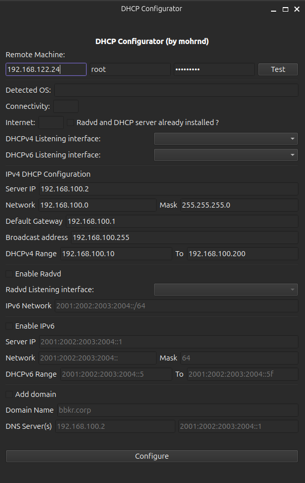

# **DHCP Configurator**  

## **Overview**  
**DHCP Configurator** is a **C++ application** that allows users to remotely configure a **DHCP server** over **SSH**. This tool automates DHCP setup on remote machines, supporting both **IPv4 and IPv6**, along with additional network settings like **RADVD for IPv6, custom domain names, and DNS servers**.  
🔹 Currently, the tool is only compatible with Debian-based servers (Debian, Ubuntu, etc.).

## **Features**  
✅ **Remote DHCP configuration via SSH**  
✅ **Supports DHCPv4 and DHCPv6**  
✅ **IPv4 and IPv6 range, gateway, and mask setup**  
✅ **RADVD (Router Advertisement Daemon) integration** for IPv6 networks  
✅ **Custom domain name and DNS configuration**  
✅ **Graphical user interface (GUI) for easy setup**  

## **Requirements**  
- **Linux-based remote machine** with root SSH access  
- Required libraries:  
  - **libssh** (for SSH communication)  
  - **Qt** (for GUI)  

## **Usage**  
1. **Enter the remote machine details** (IP address, SSH credentials).  
2. **Define DHCP settings**, such as:  
   - Server IP, network range, subnet mask, gateway  
   - Enable **RADVD** for IPv6  
   - Set **custom domain names and DNS servers**  
3. **Click "Configure"** to remotely apply the DHCP configuration.  

## **Screenshot**  

## **Future Improvements**  
- Support for **additional DHCP options** (PXE boot, lease time configuration, etc.).  
- **Logging and error handling improvements**.  

## **Contributing**  
Feel free to **open issues, submit pull requests**, or suggest new features!  

